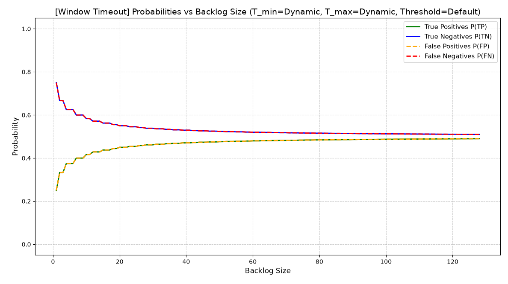
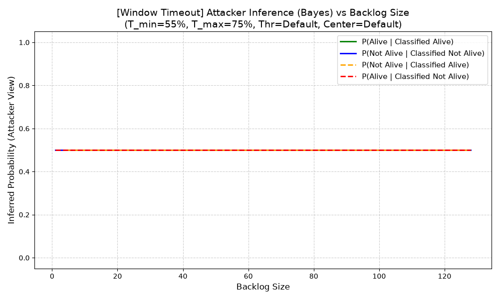
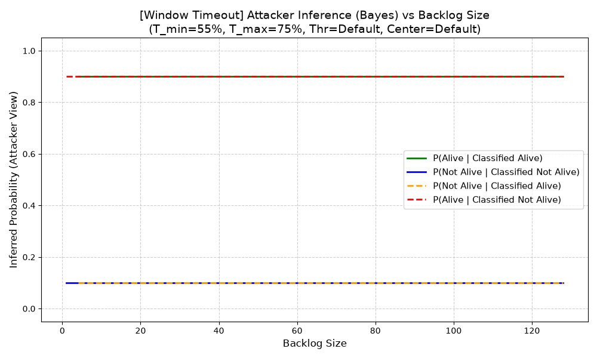

# Aggiunta dei Timeout alla Mitigazione Precedente
Una possibile modifica che si può fare è quella di usare dei timeout per l'effettiva eviction delle connessioni a seguito di un reset. Questo significa che esse rimarranno nel backlog fino a che non scadrà un certo timer facendo si che, anche nel caso in cui la vittima fosse attiva, il kernel supererebbe la soglia che andrebbe a fare l'eviction anche di una parte dei canary.

Iniziamo assumendo che il timer usato per i canary sia sicuramente inferiore a quello che scatenerà la cancellazione delle connessioni semiaperte a seguito del superamento della soglia, ma anche dell'intervallo di tempo massimo permesso ad una connessione semiaperta prima di essere automaticamente rimossa. Questo è ragionevole essendo che il tempo è determinato dallo zombie, quindi possiamo impostare un timer pari o superiore a quello.
Abbiamo sempre che l'attaccante invia $T_{n-1}$ pacchetti, di cui:
- $S_n=\frac{1}{2}T_{n-1}$ pacchetti spoofed per la vittima
- $C_n=\frac{1}{2}T_{n-1}$ pacchetti canary

Assumiamo anche la connessione semiaperta va buttata via se una "uguale" arriva, ovvero dobbiamo comportarci esattamente come se essa non esistesse.

Se la vittima:
- è spenta, allora i pacchetti in coda saranno $Q_n=S_n+C_n = T_{n+1}$
- è attiva, allora i pacchetti in coda saranno $Q_n=S_n+C_n = T_{n+1}$
  → notare il numero uguale di connessioni al tempo in cui l'attaccante farà il test

L'attaccante seguirà ancora la logica seguente per capire se la vittima è attiva o meno:
- rilevamento viva: $Q_n < T_n$, ovvero il numero di canary supera la soglia
  → sostituendo con $Q_n= T_{n-1}$ otteniamo $T_{n-1}< T_n$
- rilevamento spenta: $Q_n \ge T_n$, ovvero il numero di canary non supera la soglia
  → sostituendo con $Q_n= T_{n-1}$ otteniamo $T_{n-1}\ge T_n$
Abbiamo quindi che l'attaccante <u>penserà</u> che la vittima è :
- attiva se $T_{n-1}< T_n$
- spenta se $T_{n-1}\ge T_n$

Ora possiamo calcolare tutti i casi per tutte le possibili soglie nella finestra $(T_{n-1}, T_n)$, che corrisponderà necessariamente a $(T_{min}, T_{max})$, per cui la "larghezza" della stessa è ancora $w(B) = T_{max} - T_{min} + 1$. Sempre come prima, lo spazio campionario di soglie che dobbiamo andare a verificare ha dimensione $w(B)^2$ (abbiamo una matrice di soglie).

| $T_{n-1} \backslash T_n$ | $T_n=1$ | $T_n=2$ | $T_n=3$ | $T_n=4$ |
| ------------------------ | ------- | ------- | ------- | ------- |
| $T_{n-1}=1$              | $(1,1)$ | $(1,2)$ | $(1,3)$ | $(1,4)$ |
| $T_{n-1}=2$              | $(2,1)$ | $(2,2)$ | $(2,3)$ | $(2,4)$ |
| $T_{n-1}=3$              | $(3,1)$ | $(3,2)$ | $(3,3)$ | $(3,4)$ |
| $T_{n-1}=4$              | $(4,1)$ | $(4,2)$ | $(4,3)$ | $(4,4)$ |

Ora calcoliamo le probabilità effettive:
- **occorrenze true positive $n(TP)$:** dato un target alive, questo è classificato come tale se non vengono droppati canary, quindi quando $T_{n-1}<T_n$, ovvero nella "parte superiore" della matrice delle soglie, diagonale esclusa. Ne consegue che abbiamo il seguente numero di casi e probabilità

$$
n(TP)=\frac{w(B)^2-w(B)}{2}\qquad\qquad\qquad P(TP)=\frac{\frac{w(B)^2-w(B)}{2}}{w(B)^2}=\frac{w(B)-1}{2\cdot w(B)}=\frac{1}{2}-\frac{1}{2w(B)}
$$
- **occorrenze false negative $n(FN)$:** accade quando $T_{n-1} \ge T_n$, ed è il complementare del caso precedente:

$$
n(FN)=1-n(TP)\qquad\qquad\qquad P(FN)=1-P(TP)=\frac{1}{2w(B)}+\frac{1}{2}
$$
- **occorrenze false positive $n(FP)$:** accade quando l'attaccante sbaglia a classificare, ovvero quando manda troppi pochi canary, ergo quando $T_{n-1}< T_n$. Notiamo che il conteggio dei casi in cui accade ciò è analogo ai conti effettuati per i False Negative (parte inferiore della matrice compresa la diagonale), quindi otterremmo:

$$
n(FP)=1-\frac{w(B)^2-w(B)}{2}\qquad\qquad\qquad P(FP)=\frac{1}{2w(B)}+\frac{1}{2}
$$
- **occorrenze true negative $n(TN)$:** accade quando $T_{n-1}\ge T_n$

$$
\begin{aligned}n(TN)&=1-n(FP)\\&=\frac{w(B)^2-w(B)}{2}\end{aligned}\qquad\qquad\qquad P(TN)=1-P(FP)=\frac{1}{2}-\frac{1}{2w(B)}
$$

Riassumendo, abbiamo le seguenti probabilità:

|                      | **Classificazione Alive**     | **Classificazione Not-Alive** |
| -------------------- | ----------------------------- | ----------------------------- |
| **Target Alive**     | $\frac{1}{2}-\frac{1}{2w(B)}$ | $\frac{1}{2w(B)}+\frac{1}{2}$ |
| **Target Not-Alive** | $\frac{1}{2}-\frac{1}{2w(B)}$ | $\frac{1}{2w(B)}+\frac{1}{2}$ |

Notiamo immediatamente un fatto molto interessante, ovvero che al crescere di $w(B)$, ovvero la nostra finestra, otteniamo che tutte le probabilità tendano a convergere al $50\%$ sia per target alive che not-alive, ovvero quello che ci eravamo prefissati di fare sin dall'inizio. L'unica assunzione che dobbiamo fare è che il timer duri sicuramente di più del tempo impiegato dall'attaccante per effettuare l'attacco.

Notiamo anche come veri e falsi positivi/negativi assumano la stessa probabilità, cosa che ci permette di concludere che una vittima venga classificata correttamente nel $50\%$ dei casi, con un certo bias verso il classificarle come Not-Alive per dimensioni della backlog molto basse. Questo fatto è supportato dal plot delle probabilità condizionate, ovvero quelle che "vedrebbe" l'attaccante se potesse sapere in un secondo momento lo stato effettivo della vittima:

Se volessimo cambiare la percentuale di vittime che assumiamo essere vive dietro ad uno zombie, vedremmo correttamente come la probabilità di vittima Alive o meno sia sempre uguale sia che l'attaccante le abbia classificate come Alive o Not-Alive. L'unica differenza rispetto al grafico precedente è che abbiamo più vittime vive (il $90\%$), cosa che effettua lo "scostamento" delle probabilità.

# Mitigazione con solo Timeout e Percentuale Durata
Possiamo notare come la mitigazione in se non necessiti più della [soglia variabile](Teoria.md) in quanto, avendo un timeout pari al tempo impiegato dalle connessioni a venire eliminate, otteniamo un comportamento delle connessioni nella SYN queue analogo sia per vittime alive che per le not-alive. 

Possiamo quindi introdurre la variabile aleatoria seguente, la quale estrae valori usati per la durata del timer da un'uniforme fra due soglie $tm_{min}$ per il tempo minimo e $tm_{max}$ per quello massimo: 
$$
timer\_pct\sim U(tm_{min}, tm_{max})
$$
il quale indicherà la percentuale di tempo per cui durerà il timer delle connessioni che ricevono un RST prima di essere rimosse effettivamente dalla backlog. Questo ci permetterà di analizzare l'impatto che avrà un timer più corto rispetto alla capacità dell'attaccante di capire il vero stato di una vittima.

Con $tm_a$ indicheremo il tempo atteso dall'attaccante prima di verificare la presenza dei canary.

Calcoliamo quindi le diverse probabilità
- **occorrenze true positive $n(TP)$:** una vittima è correttamente identificata con probabilità $P(timer\_pct\le tm_a)$, ovvero:
$$
P(TP)=P(timer\_pct \le tm_a)=\int_{tm_{min}}^{tm_a} \frac{1}{tm_{max}-tm_{min}}=\frac{tm_a-tm_{min}}{tm_{max}-tm_{min}}
$$
- **occorrenze false negative $n(FN)$:** caso complementare del precedente, quindi procediamo come segue:
$$
\begin{aligned}
P(FN)=1-P(TP)&=1-\frac{tm_a-tm_{min}}{tm_{max}-tm_{min}} \\
& =\frac{tm_{max}-tm_{min}-tm_a+tm_{min}}{tm_{max}-tm_{min}} \\
&=\frac{tm_{max}-tm_a}{tm_{max}-tm_{min}}
\end{aligned}
$$
- **occorrenze true negative $n(TN)$:** una vittima not-alive non andrà ad attivare la mitigazione oltre al fatto che, non inviando i RST, causerà sempre l'eviction di una parte dei canary, quindi verrà sempre classificata come not-alive
$$
P(TN)=1
$$
- **occorrenze false positive $N(FP)$:** situazione analoga alla precedente, non avremmo mai delle classificazioni come attive, quindi:
$$
P(FP)=0
$$

Concludiamo quindi con la seguente tabella:

|                      | **Classificazione Alive**                 | **Classificazione Not-Alive**               |
| -------------------- | ----------------------------------------- | ------------------------------------------- |
| **Target Alive**     | $\frac{tm_a-tm_{min}}{tm_{max}-tm_{min}}$ | $\frac{tm_{max}-tm_a}{tm_{max}-tm_{min}},1$ |
| **Target Not-Alive** | $0$                                       | $1$                                         |
Possiamo intuitivamente notare come appena l'attaccante rilevi che la vittima è attiva, esso abbia la certezza che lo sia effettivamente. 

Tecnicamente dovremmo effettuare i controlli/conti seguenti per avere delle vere e proprie probabilità in output:
$$
P(TP)=\begin{cases}
0 & tm_a \le tm_{min} \\
\frac{tm_a - tm_{min}}{tm_{max} - tm_{min}} & tm_{min} < tm_a < tm_{max} \\
1 & tm_a \ge tm_{max} \end{cases}
\qquad\qquad\qquad
P(FN)=1-P(TP)
$$